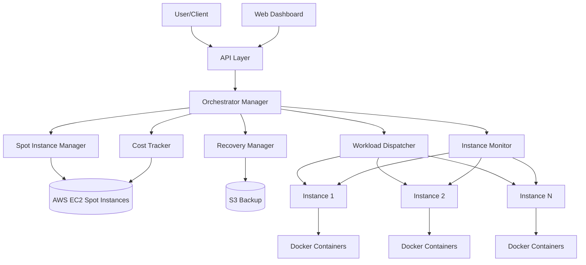
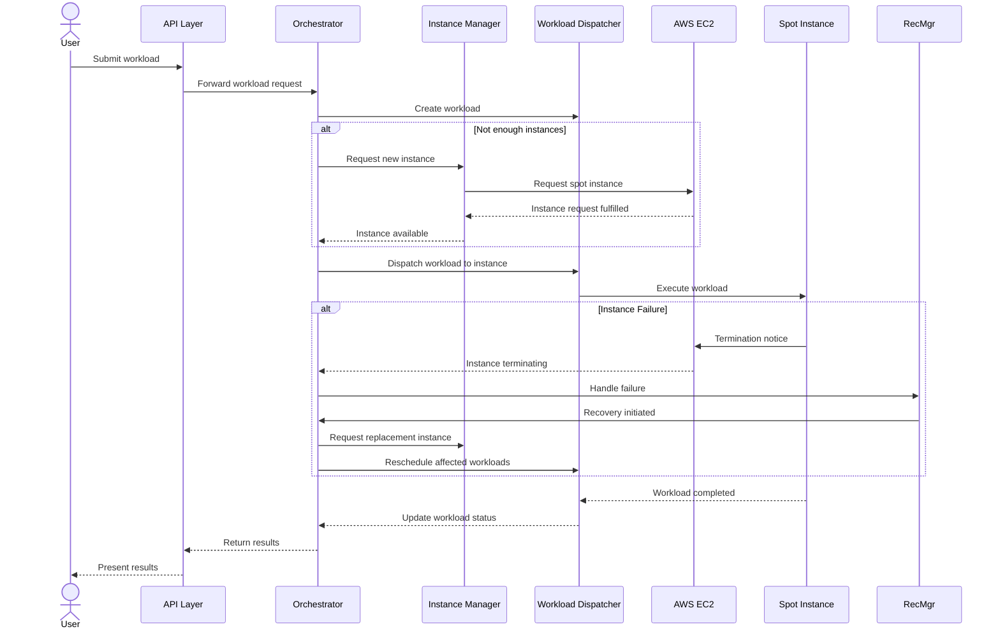
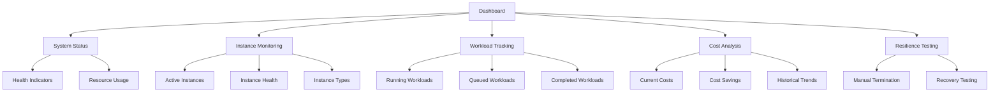
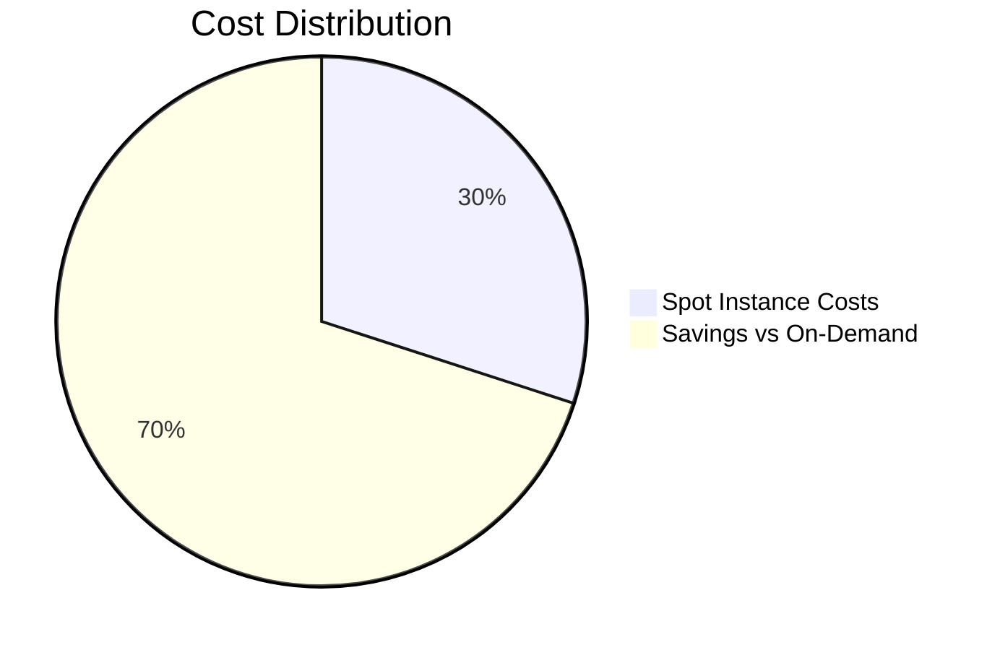

# SpottyCloud: Distributed Computing on AWS Spot Instances

## Overview

SpottyCloud is a lightweight system for managing distributed computing tasks across low-cost cloud servers (AWS Spot Instances). This solution allows teams to experiment with running different types of workloads while learning how to handle sudden server failures gracefully.

## Table of Contents

- [Project Structure](#project-structure)
- [Core Components](#core-components)
- [Architecture](#architecture)
- [Workload Types](#workload-types)
- [Deployment & Configuration](#deployment--configuration)
- [Dashboard & Monitoring](#dashboard--monitoring)
- [Resilience Features](#resilience-features)
- [Cost Tracking](#cost-tracking)
- [Getting Started](#getting-started)

## Project Structure

```
spotty_cloud/
├── api/                     # RESTful API endpoints
│   ├── endpoints/           # API endpoint implementations
│   └── routes/              # API route definitions
├── config/                  # System configuration files
│   ├── profiles/            # Environment-specific configurations
│   ├── templates/           # Configuration templates
│   ├── config_manager.py    # Configuration loading and management
│   └── spotty_cloud.yaml    # Main configuration file
├── core/                    # Core system functionality
│   ├── instances/           # Spot instance management
│   │   └── spot_manager.py  # Creates and manages AWS Spot instances
│   ├── orchestrator/        # Multi-server orchestration
│   │   └── manager.py       # Orchestrates workloads across instances
│   └── resilience/          # Failure recovery mechanisms
│       └── recovery.py      # Handles instance failures and recovery
├── dashboard/               # Monitoring and visualization interfaces
│   ├── backend/             # API server for the dashboard
│   │   └── server.py        # Flask server for dashboard backend
│   ├── frontend/            # Web UI for monitoring
│   │   ├── app.js           # Dashboard JavaScript
│   │   ├── index.html       # Dashboard HTML
│   │   └── styles.css       # Dashboard CSS
│   └── streamlit/           # Alternative Streamlit-based dashboard
│       └── gui.py           # Streamlit dashboard implementation
├── docker/                  # Docker configurations for workloads
│   ├── Dockerfile.encoding  # Container for CPU-based video encoding
│   ├── Dockerfile.train     # Container for ML model training
│   └── Dockerfile.training  # Alternative ML training container
├── tests/                   # Test suites
│   ├── integration/         # Integration tests
│   └── unit/                # Unit tests
├── utils/                   # Utilities and helpers
│   ├── aws/                 # AWS-specific utilities
│   │   └── credentials.py   # AWS credentials management
│   ├── backup/              # Data backup mechanisms
│   ├── cost/                # Cost tracking and estimation
│   │   └── tracker.py       # Tracks and reports on AWS costs
│   └── monitoring/          # System monitoring tools
│       └── instance_monitor.py  # Monitors instance health
├── workloads/               # Workload definitions and runners
│   ├── runners/             # Workload execution engines
│   │   └── dispatcher.py    # Dispatches workloads to instances
│   ├── scripts/             # Execution scripts for workloads
│   │   ├── edge/            # Edge computing scripts
│   │   │   └── simulate.py  # Edge computing simulation
│   │   ├── ml/              # Machine learning scripts
│   │   │   └── train.py     # ML model training script
│   │   └── video/           # Video processing scripts
│   │       ├── download_sample.py  # Downloads sample videos
│   │       └── encode_videos.py    # Video encoding script
│   └── templates/           # Workload template definitions
│       ├── edge_computing.yaml  # Edge computing workload template
│       ├── ml_training.yaml     # ML training workload template
│       └── video_encoding.yaml  # Video encoding workload template
├── main.py                  # Main entry point for the application
└── README.md                # Project documentation
```

## Core Components

### Orchestrator

The orchestrator is the central component of SpottyCloud, responsible for:

- Managing a pool of AWS Spot Instances (around 3-4 servers)
- Distributing workloads based on their resource requirements
- Monitoring instance health and handling failures
- Scaling the instance pool up or down based on workload demand

The `OrchestratorManager` class in `core/orchestrator/manager.py` implements this functionality, coordinating between the instance manager, recovery manager, and workload dispatcher.

### Instance Manager

The instance manager (`core/instances/spot_manager.py`) handles:

- Requesting new AWS Spot Instances with appropriate configurations
- Monitoring spot instance requests and handling fulfillment
- Terminating instances when they're no longer needed
- Supporting different instance types for various workloads (CPU, GPU, edge)

### Recovery Manager

The recovery manager (`core/resilience/recovery.py`) ensures system resilience by:

- Handling instance failures with a 2-minute recovery time
- Backing up workload data before instance termination
- Restarting workloads on new instances after failures
- Tracking recovery statistics and success rates

### Workload Dispatcher

The workload dispatcher (`workloads/runners/dispatcher.py`) is responsible for:

- Accepting workload submission requests
- Matching workloads with appropriate instances
- Tracking workload execution status
- Handling completion and failure scenarios

## Architecture

### System Overview



### Workflow Sequence



## Workload Types

SpottyCloud supports three primary types of workloads, each with specific resource requirements:

### 1. CPU-Intensive Workloads

For general-purpose computing tasks like video encoding:

- Uses standard CPU-optimized instances (c5.large, c5.xlarge)
- Runs in containers defined by Dockerfile.encoding
- Template: `workloads/templates/video_encoding.yaml`
- Sample script: `workloads/scripts/video/encode_videos.py`

### 2. GPU-Accelerated Workloads

For machine learning and AI tasks:

- Uses GPU-enabled instances (g4dn.xlarge, p3.2xlarge)
- Runs in containers defined by Dockerfile.training
- Template: `workloads/templates/ml_training.yaml`
- Sample script: `workloads/scripts/ml/train.py`

### 3. Edge Computing Workloads

For simulating edge computing scenarios:

- Uses cost-efficient instances (t3.medium, t3.large)
- Runs in containers defined by Dockerfile.edge
- Template: `workloads/templates/edge_computing.yaml`
- Sample script: `workloads/scripts/edge/simulate.py`

## Deployment & Configuration

The system is configured through `config/spotty_cloud.yaml`, which includes settings for:

- AWS region and instance types
- Orchestrator parameters (min/max instances)
- Resilience settings (recovery time, backup frequency)
- Monitoring thresholds
- Cost tracking parameters

### Instance Scale Configuration

```yaml
orchestrator:
  min_instances: 3
  max_instances: 20
  instance_pool_size: 10
  polling_interval: 30
```

### AWS Instance Types

```yaml
aws:
  spot:
    instance_types:
      cpu:
        - c5.large
        - t3.medium
      gpu: 
        - g4dn.xlarge
        - p3.2xlarge
      edge:
        - t3.medium
        - t3.small
```

### Resilience Settings

```yaml
resilience:
  termination_check_interval: 5
  backup_frequency: 60
  max_recovery_time: 120  # 2 minutes recovery time
  auto_recover: true
```

## Dashboard & Monitoring

The system includes a web-based dashboard for monitoring:

- Instance status and health
- Active workloads and their status
- Cost savings compared to on-demand pricing (60-80% savings)
- System performance metrics

The dashboard is served by a Flask backend (`dashboard/backend/server.py`) and a browser-based frontend (`dashboard/frontend/`).

### Dashboard Components



## Resilience Features

The system demonstrates resilience through several mechanisms:

### 1. Automatic Recovery

- Detects spot instance termination notices and initiates recovery process
- Completes recovery within 2 minutes as per POC requirements
- Reschedules affected workloads on new instances

### 2. Data Persistence

- Automatically backs up workload data to S3
- Recovers workload state after instance failure
- Supports checkpointing for longer-running workloads

### 3. Failure Testing

The dashboard includes a resilience testing interface that allows:

- Manual termination of specific instances
- Simulation of random failures
- Measurement of recovery time and success rates

## Cost Tracking

The cost tracking system (`utils/cost/tracker.py`):

- Compares spot instance costs with equivalent on-demand prices
- Demonstrates 60-80% cost savings as specified in the POC
- Provides historical cost data and projections
- Visualizes savings through the dashboard

### Cost Components



## Getting Started

### Prerequisites

- AWS account with API access
- Python 3.10+
- Docker and Docker Compose

### Installation

1. Clone the repository:
```bash
git clone <repository-url>
cd spotty_cloud
```

2. Install dependencies:
```bash
pip install -r requirements.txt
```

3. Configure AWS credentials:
```bash
aws configure
```

4. Update configuration in `config/spotty_cloud.yaml` as needed.

### Running the System

1. Start the SpottyCloud system:
```bash
python -m spotty_cloud.main
```

2. Access the dashboard:
```
http://localhost:8080
```

### Submitting Workloads

Workloads can be submitted through:

1. The dashboard interface
2. The REST API
3. Command-line interface

Example API request to submit a workload:

```bash
curl -X POST http://localhost:8080/api/workloads -H "Content-Type: application/json" -d '{
  "type": "ml-training",
  "parameters": {
    "model_type": "resnet50",
    "epochs": 10,
    "batch_size": 32
  }
}'
```

## Conclusion

SpottyCloud demonstrates a cost-effective approach to cloud computing by leveraging AWS Spot Instances, with features for workload orchestration, automated recovery, and cost optimization. The system achieves 60-80% cost savings compared to on-demand pricing while maintaining resilience to instance failures with a 2-minute recovery time.
